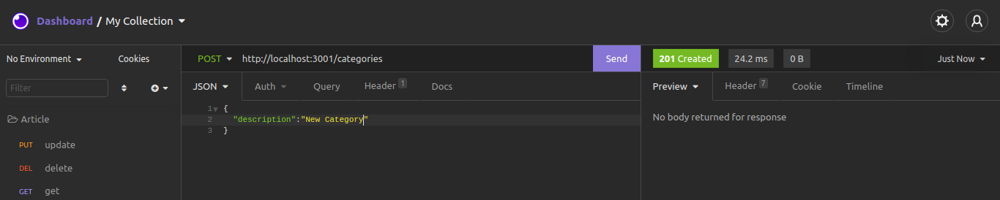
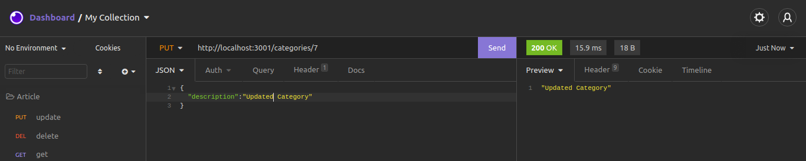
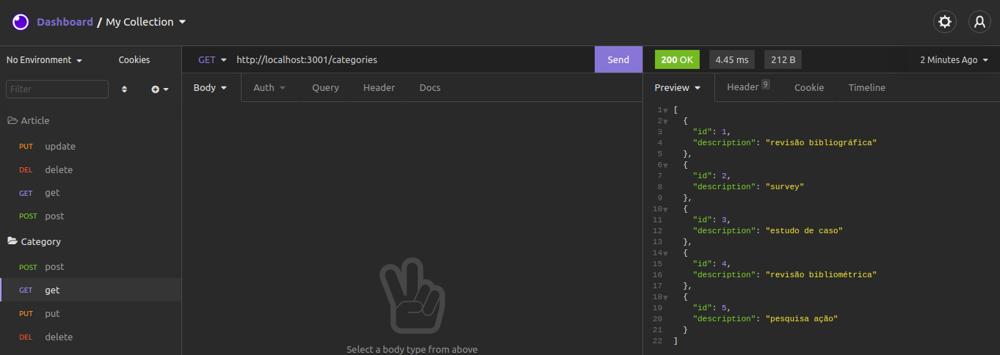
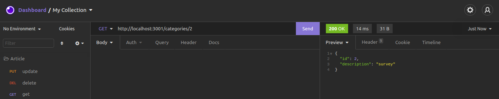
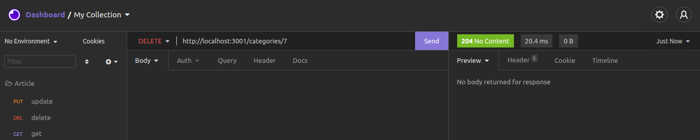
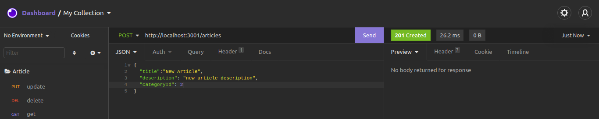
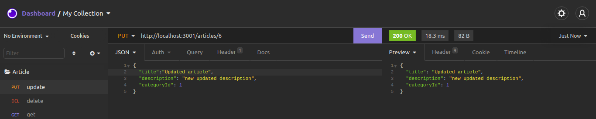
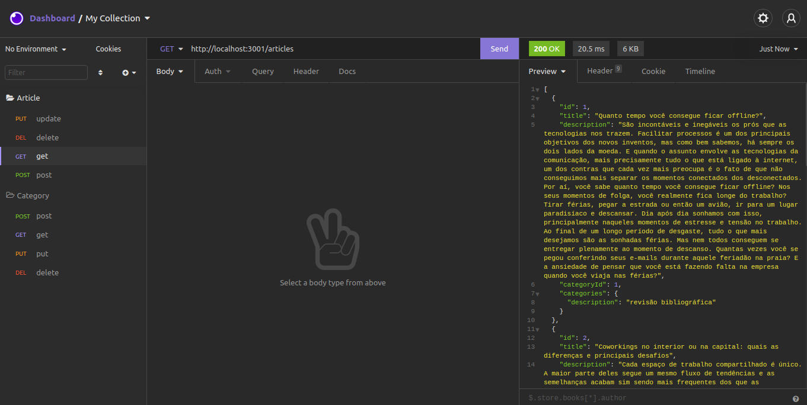
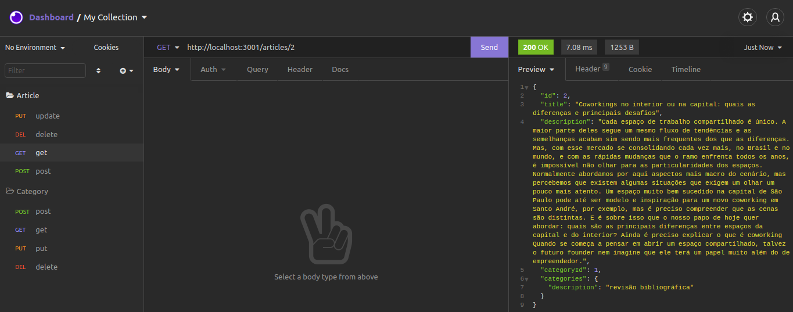
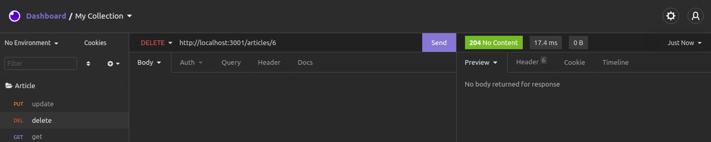

## Desafio Técnico BIUD

Este projeto foi proposto na etapa técnica do processo seletivo para a vaga de Desenvolvedor Front-End na BIUD.
É um projeto web completo onde o principal objetivo era criar um web app onde o usuário possa cadastrar **categorias** e, posteriormente cadastrar **artigos** vinculados a essas categorias.
O desafio também contempla o back-end como um opcional, que seria um diferencial na hora da avaliação do projeto.

---

## Sumário

- [Requisitos](#Requisitos)
- [Tecnologias utilizadas](#Tecnologias-utilizadas)
  - [Front-end](#Tecnologias-Front-end)
  - [Back-end](#Tecnologias-Back-end)
- [Implementação](#Implementação)
- [Back-end](#Back-end)
  - [Endereço do back-end](#Endereço-do-back-end)
  - [Endpoints de Categoria](#Endpoints-de-Categoria)
    - [Endpoint para o cadastro de categoria](#Endpoint-para-o-cadastro-de-categoria)
    - [Endpoint para o atualizar categoria](#Endpoint-para-o-atualizar-categoria)
    - [Endpoint para buscar categorias](#Endpoint-para-buscar-categorias)
    - [Endpoint para buscar uma categoria](#Endpoint-para-buscar-uma-categoria)
    - [Endpoint para apagar uma categoria:](Endpoint-para-apagar-uma-categoria)
  - [Endpoints de Artigo](#Endpoints-de-Artigo)
    - [Endpoint para o cadastro de artigo](#Endpoint-para-o-cadastro-de-artigo)
    - [Endpoint para o atualizar artigo](#Endpoint-para-atualizar-artigo)
    - [Endpoint para buscar artigos](#Endpoint-para-buscar-artigos)
    - [Endpoint para buscar um artigo](#Endpoint-para-buscar-um-artigo)
    - [Endpoint para apagar um artigo](#Endpoint-para-apagar-um-artigo)
- [Como executar o projeto](#Como-executar-o-projeto)

---

### Requisitos

Para executar este projeto é necessário ter instalado em seu computador o [**Node.js**](https://nodejs.org/en/){:target="_blank"} e o [**MySQL*](https://www.mysql.com/){:target="_blank"}.

---

### Tecnologias utilizadas:

#### Tecnologias Front-end:

* ReactJS
* ReactRouterDOM
* Axios
* SweetAlert
* Eslint
* StyleLint

#### Tecnologias Back-end:

* NodeJS
* ExpressJS
* Sequelize (**ORM**)
* MySQL
* HttpStatusCode
* DotEnv
* Cors

---

### Implementação:

O **Front-end** foi implementado com 8 páginas, sendo elas:

* Tela Principal
* Lista de categorias
* Cadastrar categoria
* Editar categoria
* Lista de artigos
* Cadastrar artigo
* Editar artigo
* Ler artigo

O **Back-end** foi implementado com os seguites Endpoints:

* `/categories` (*GET*, *POST*)
* `/categories/id` (*GET*, *PUT*, *DELETE*)
* `/articles` (*GET*, *POST*)
* `/categories/id` (*GET*, *PUT*, *DELETE*)

---

## Back-end

### Endereço do back-end:

- O back-end por padrão deve rodar na porta `http://localhost:3001`.

### Endpoints de Categoria:

#### Endpoint para o cadastro de categoria:

- O endpoint é acessível através do caminho (`/categories`);

- O endpoint deve receber a seguinte estrutura:

```json
{
  "description": "nome_da_categoria"
}
```



#### Endpoint para o atualizar categoria:

- O endpoint é acessível através do caminho (`/categories/:id`);

- O endpoint deve receber a seguinte estrutura:

```json
{
  "description": "nome_da_categoria"
}
```




#### Endpoint para buscar categorias:

- O endpoint é acessível através do caminho (`/categories`);



#### Endpoint para buscar uma categoria:

- O endpoint é acessível através do caminho (`/categories/:id`);



#### Endpoint para apagar uma categoria:

- O endpoint é acessível através do caminho (`/categories/:id`);



### Endpoints de Artigo:

#### Endpoint para o cadastro de artigo:

- O endpoint é acessível através do caminho (`/articles`);

- O endpoint deve receber a seguinte estrutura:

```json
{
  "title": "titulo_do_artigo",
  "description": "descrição_do_artigo",
  "categoryId": "id_da_categoria"
}
```



#### Endpoint para atualizar artigo:

- O endpoint é acessível através do caminho (`/articles/:id`);

- O endpoint deve receber a seguinte estrutura:

```json
{
  "title": "titulo_do_artigo",
  "description": "descrição_do_artigo",
  "categoryId": "id_da_categoria"
}
```



#### Endpoint para buscar artigos:

- O endpoint é acessível através do caminho (`/articles`);



#### Endpoint para buscar um artigo:

- O endpoint é acessível através do caminho (`/articles/:id`);




#### Endpoint para apagar um artigo:

- O endpoint é acessível através do caminho (`/articles/:id`);



---

### Como executar o projeto

1. Clone o repositório:
  * `git clone git@github.com:thiagopcdev/BIUD_challenge.git`
2. Entre na pasta do repositório que você acabou de clonar:
  * `cd BIUD_challenge`
3. Instale as dependências:
  * `npm install`
4. Acesse o arquivo **.env** dentro da pasta backend: 
  * `cd backend`
5. Dentro do arquivo .env altere o usuário e senha de acordo com o cadastro do seu MySQL: 
  * `MYSQL_USER, MYSQL_PASSWORD`
7. Retorne para a pasta raiz do projeto:
  * `cd ..`
8. Execute o programa:
  * `npm start`

Feito isto, o seu navegador padrão deve abrir automaticamente com o endereço local,
caso nada aconteça, basta abrir seu navegador preferido e inserir a url `localhost:3000`.

**IMPORTANTE**
Para encerrar a aplicação, basta executar o comando `npm stop`, para isto certifique-se que você esteja na raiz da pasta BIUD_Challenge.

---