## Desafio Técnico BIUD

Este projeto foi proposto na etapa técnica do processo seletivo para a vaga de Desenvolvedor Front-End na BIUD.
É um projeto web completo onde o principal objetivo era criar um web app onde o usuário possa cadastrar **categorias** e, posteriormente cadastrar **artigos** vinculados a essas categorias.
O desafio também contempla o back-end como um opcional, que seria um diferencial na hora da avaliação do projeto.

---

## Sumário

- [Requisitos](#Requisitos)
- [Tecnologias utilizadas](#Tecnologias-utilizadas)
  - [Front-end](#Tecnologias-Front-end)
  - [Back-end](#Tecnologias-Back-end)
- [Implementação](#Implementação)
- [Front-end](#Front-end)
    - [Pagina principal](#Pagina-principal)
    - [Pagina de categorias](#Pagina-de-categorias)
    - [Pagina cadastrar categoria](#Pagina-cadastrar-categoria)
    - [Pagina editar categoria](#Pagina-editar-categoria)
    - [Pagina de artigos](#Pagina-de-artigos)
    - [Pagina cadastrar artigo](#Pagina-cadastrar-artigo)
    - [Pagina editar artigo](#Pagina-editar-artigo)
    - [Pagina mostrar artigo](#Pagina-mostrar-artigo)
- [Back-end](#Back-end)
  - [Endereço do back-end](#Endereço-do-back-end)
  - [Endpoints de Categoria](#Endpoints-de-Categoria)
    - [Endpoint para o cadastro de categoria](#Endpoint-para-o-cadastro-de-categoria)
    - [Endpoint para o atualizar categoria](#Endpoint-para-o-atualizar-categoria)
    - [Endpoint para buscar categorias](#Endpoint-para-buscar-categorias)
    - [Endpoint para buscar uma categoria](#Endpoint-para-buscar-uma-categoria)
    - [Endpoint para apagar uma categoria:](Endpoint-para-apagar-uma-categoria)
  - [Endpoints de Artigo](#Endpoints-de-Artigo)
    - [Endpoint para o cadastro de artigo](#Endpoint-para-o-cadastro-de-artigo)
    - [Endpoint para o atualizar artigo](#Endpoint-para-atualizar-artigo)
    - [Endpoint para buscar artigos](#Endpoint-para-buscar-artigos)
    - [Endpoint para buscar um artigo](#Endpoint-para-buscar-um-artigo)
    - [Endpoint para apagar um artigo](#Endpoint-para-apagar-um-artigo)
- [Como executar o projeto](#Como-executar-o-projeto)

---

### Requisitos

Para executar este projeto é necessário ter instalado em seu computador o [**Node.js**](https://nodejs.org/en/) e o [**MySQL**](https://www.mysql.com/).

---

### Tecnologias utilizadas:

#### Tecnologias Front-end:

* [ReactJS](https://pt-br.reactjs.org/);
* [ReactRouterDOM](https://v5.reactrouter.com/web/guides/quick-start);
* [Axios](https://axios-http.com/ptbr/docs/intro);
* [SweetAlert](https://sweetalert.js.org/guides/);
* [Eslint](https://eslint.org/);
* [StyleLint](https://stylelint.io/);

#### Tecnologias Back-end:

* [NodeJS](https://nodejs.org/en/);
* [ExpressJS](https://expressjs.com/pt-br/);
* [Sequelize (**ORM**)](https://sequelize.org/);
* [MySQL](https://www.mysql.com/);
* [HttpStatusCode](https://www.npmjs.com/package/http-status-codes);
* [DotEnv](https://www.npmjs.com/package/dotenv);
* [Cors](https://www.npmjs.com/package/cors);

---

### Implementação:

O **Front-end** foi implementado com 8 páginas, sendo elas:

* [Tela Principal](#Pagina-principal)
* [Lista de categorias](#Pagina-de-categorias)
* [Cadastrar categoria](#Pagina-cadastrar-categoria)
* [Editar categoria](#Pagina-editar-categoria)
* [Lista de artigos](#Pagina-de-artigos)
* [Cadastrar artigo](#Pagina-cadastrar-artigo)
* [Editar artigo](#Pagina-editar-artigo)
* [Ler artigo](#Pagina-mostrar-artigo)


O **Back-end** foi implementado com os seguites Endpoints:

*[Endpoint para o cadastro de categoria `/categories`](#Endpoint-para-o-cadastro-de-categoria)
* `/categories` (*GET*, *POST*);
* `/categories/id` (*GET*, *PUT*, *DELETE*);
* `/articles` (*GET*, *POST*);
* `/categories/id` (*GET*, *PUT*, *DELETE*);

---

## Front-end

### Pagina principal:

- A pagina é acessível através do caminho (`/main`) ou clicando no logo da BIUD no cabeçalho da aplicação;

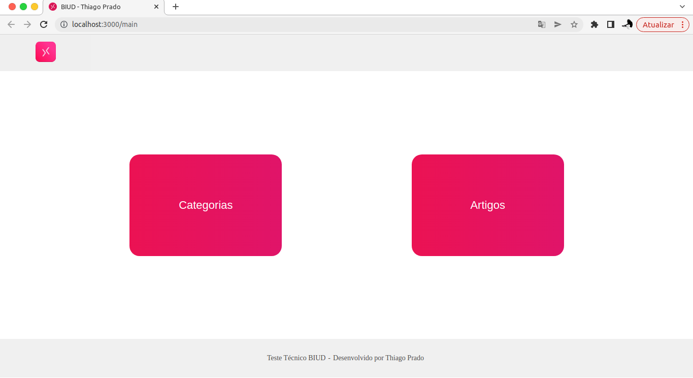


### Pagina de categorias:

- A pagina é acessível através do caminho (`/categories`);

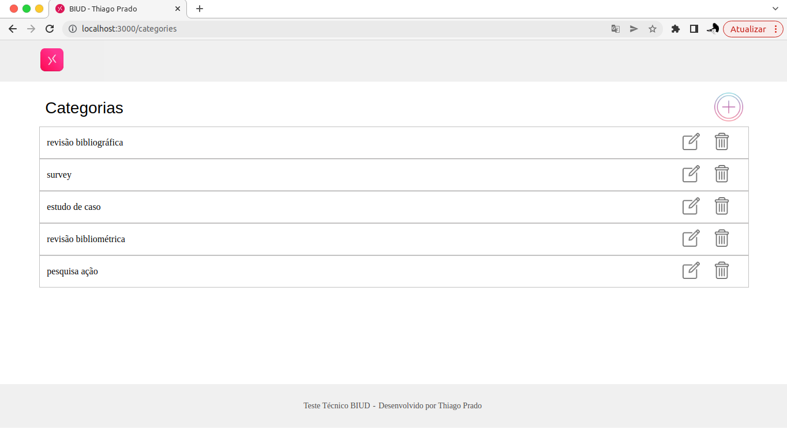

### Pagina cadastrar categoria:

- A pagina é acessível através do caminho (`/categories/new`);

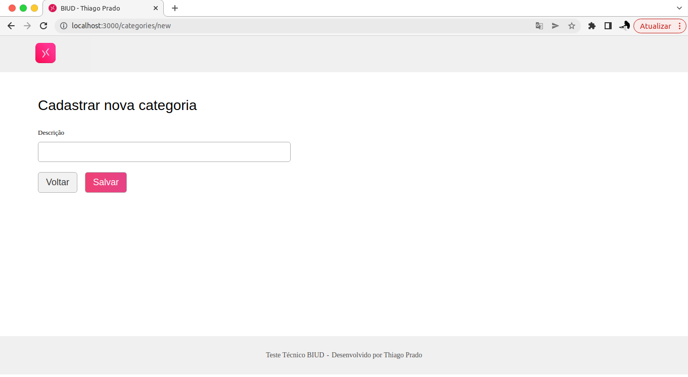

### Pagina editar categoria:

- A pagina é acessível através do caminho (`/categories/:id/modify`);

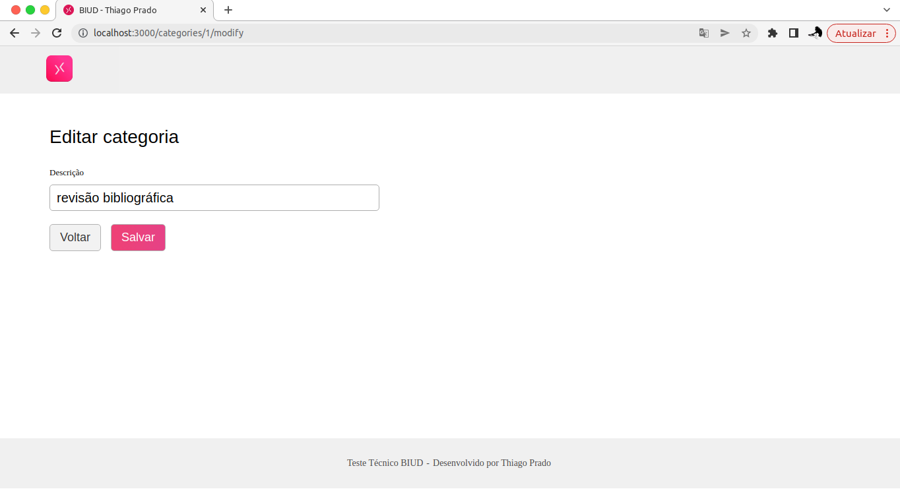

### Pagina de artigos:

- A pagina é acessível através do caminho (`/articles`);

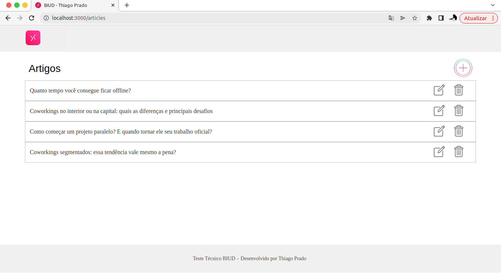

### Pagina cadastrar artigo:

- A pagina é acessível através do caminho (`/articles/new`);

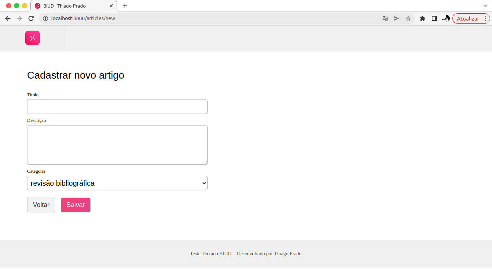

### Pagina editar artigo:

- A pagina é acessível através do caminho (`/articles/:id/modify`);

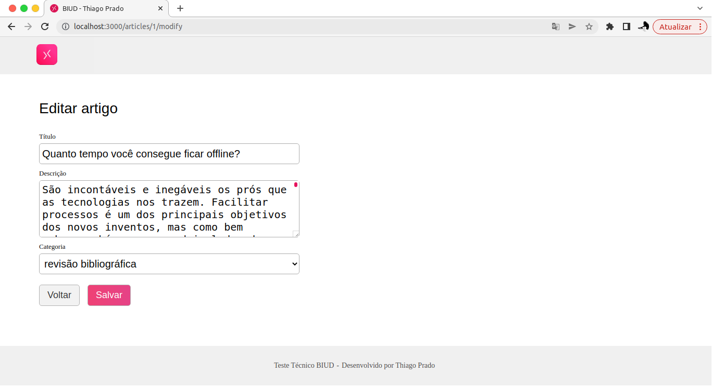

### Pagina mostrar artigo:

- A pagina é acessível através do caminho (`/articles/:id`);

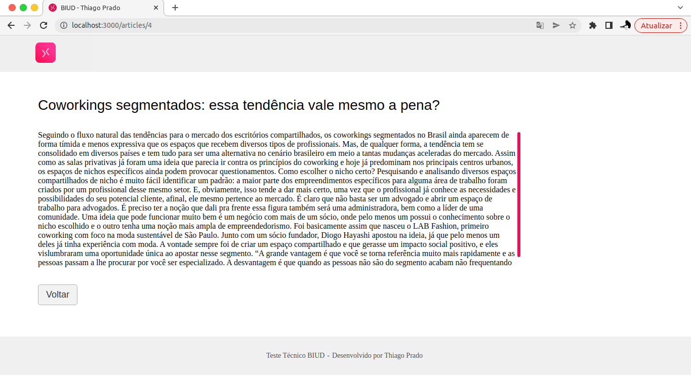

---

## Back-end

### Endereço do back-end:

- O back-end por padrão deve rodar na porta `http://localhost:3001`.

### Endpoints de Categoria:

#### Endpoint para o cadastro de categoria:

- O endpoint é acessível através do caminho (`/categories`);

- O endpoint deve receber a seguinte estrutura:

```json
{
  "description": "nome_da_categoria"
}
```

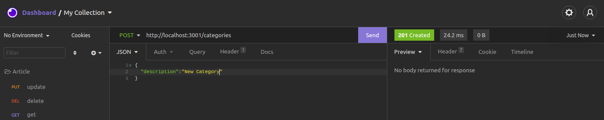

#### Endpoint para o atualizar categoria:

- O endpoint é acessível através do caminho (`/categories/:id`);

- O endpoint deve receber a seguinte estrutura:

```json
{
  "description": "nome_da_categoria"
}
```

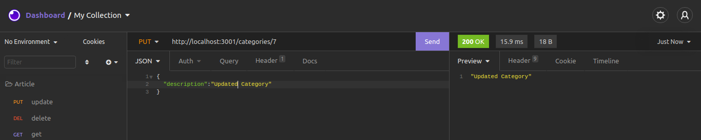


#### Endpoint para buscar categorias:

- O endpoint é acessível através do caminho (`/categories`);

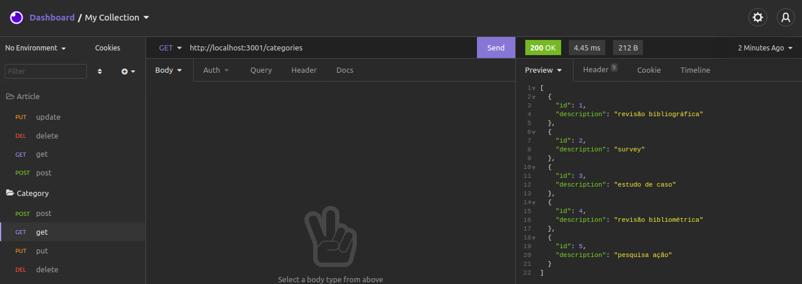

#### Endpoint para buscar uma categoria:

- O endpoint é acessível através do caminho (`/categories/:id`);

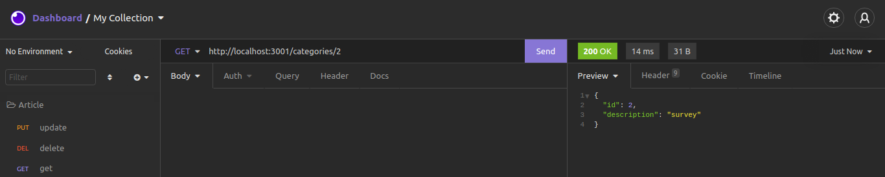

#### Endpoint para apagar uma categoria:

- O endpoint é acessível através do caminho (`/categories/:id`);

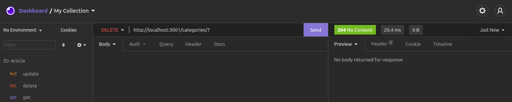

### Endpoints de Artigo:

#### Endpoint para o cadastro de artigo:

- O endpoint é acessível através do caminho (`/articles`);

- O endpoint deve receber a seguinte estrutura:

```json
{
  "title": "titulo_do_artigo",
  "description": "descrição_do_artigo",
  "categoryId": "id_da_categoria"
}
```

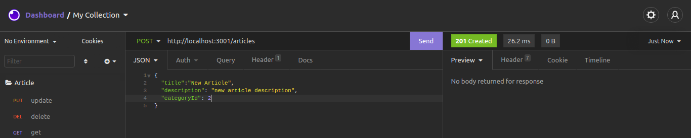

#### Endpoint para atualizar artigo:

- O endpoint é acessível através do caminho (`/articles/:id`);

- O endpoint deve receber a seguinte estrutura:

```json
{
  "title": "titulo_do_artigo",
  "description": "descrição_do_artigo",
  "categoryId": "id_da_categoria"
}
```

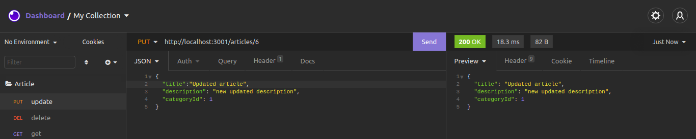

#### Endpoint para buscar artigos:

- O endpoint é acessível através do caminho (`/articles`);

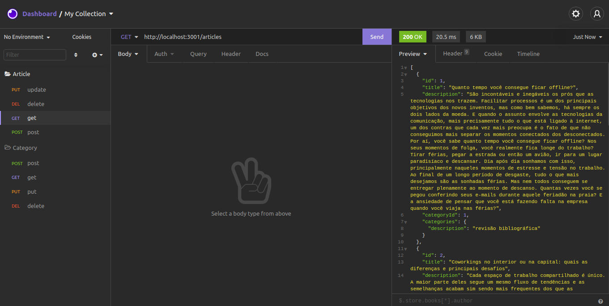

#### Endpoint para buscar um artigo:

- O endpoint é acessível através do caminho (`/articles/:id`);

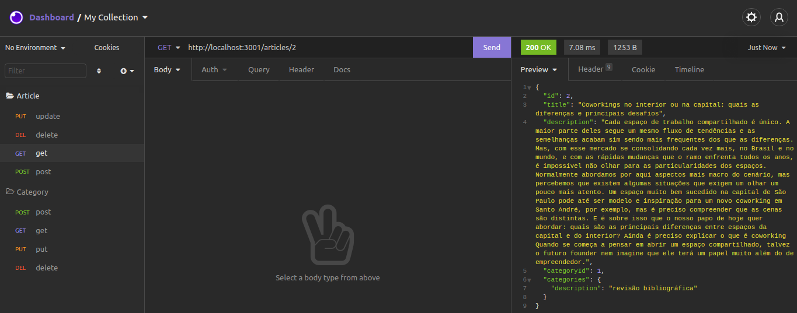


#### Endpoint para apagar um artigo:

- O endpoint é acessível através do caminho (`/articles/:id`);


---

### Como executar o projeto

1. Clone o repositório:
  * `git clone git@github.com:thiagopcdev/BIUD_challenge.git`
2. Entre na pasta do repositório que você acabou de clonar:
  * `cd BIUD_challenge`
3. Instale as dependências:
  * `npm install`
4. Acesse o arquivo **.env** dentro da pasta backend: 
  * `cd backend`
5. Dentro do arquivo .env altere o usuário e senha de acordo com o cadastro do seu MySQL: 
  * `MYSQL_USER, MYSQL_PASSWORD`
7. Retorne para a pasta raiz do projeto:
  * `cd ..`
8. Execute o programa:
  * `npm start`

Feito isto, o seu navegador padrão deve abrir automaticamente com o endereço local,
caso nada aconteça, basta abrir seu navegador preferido e inserir a url `localhost:3000`.

⚠️ **IMPORTANTE** ⚠️ 
Para encerrar a aplicação, basta executar o comando `npm stop`, para isto certifique-se que você esteja na raiz da pasta BIUD_Challenge.

---